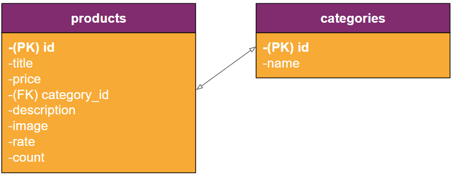

# E-commerce FakeStore

## Tópicos

- [Negócios](#título-da-seção-1)
  - [Desafio do cliente](#subtítulo-da-seção-11)
  - [Solução em linhas gerais](#subtítulo-da-seção-12)
  - [Persona e User Story](#subtítulo-da-seção-12)
  - [Requisitos Funcionais](#subtítulo-da-seção-12)
  - [Persona e User Story](#subtítulo-da-seção-12)
- [Tech](#título-da-seção-2)

  - [Definições Arquiteturais](#subtítulo-da-seção-21)
  - [Diagrama MER (Modelo Entidade-Relacionamento)](#subtítulo-da-seção-21)

  - [Subtítulo da Seção 2.2](#subtítulo-da-seção-22)

# Negócios

### Desafio do cliente

Nosso cliente busca implementar um e-commerce próprio para vender seus produtos de forma personalizada. Atualmente, o cliente depende totalmente de outros grandes e-commerces, como Mercado Livre, Magalu e Amazon. Embora os anúncios nessas plataformas atraiam novos clientes, eles prejudicam a margem de lucro.

O objetivo do cliente é continuar a captar clientes por meio desses e-commerces parceiros, mas direcioná-los e fidelizá-los ao seu próprio site de vendas, oferecendo vantagens em termos de preço, promoções e atendimento personalizado.

### Solução em linhas gerais

Essa aplicação é uma implementação personalizada da API Fake Store, desenvolvida com Node.js e React comunicando com um banco de dados SQLite.

A solução adota o padrão de design CSR(Controller-Service-Repository), onde as rotas são tratadas nos controllers, a lógica de negócio é implementada nos services e a comunicação com o banco de dados é feita através dos repositories.

A aplicação também inclui o frontend, desenvolvido com React e TypeScript, para interação com os dados e fornecer uma interface amigável e performática ao usuário.

## Persona e User Story

### Persona

A persona-alvo para essa aplicação é um proprietário de loja online que deseja escalar suas vendas e oferecer uma melhor user experience ao seu cliente. O usuário deseja ter controle total sobre as informações dos produtos, categorias, usuários e pedidos, além de poder adicionar funcionalidades adicionais conforme necessário.

### User Story

Como proprietário de uma loja de produtos variados, desejo criar um e-commerce para disponibilizar meus produtos online, permitindo que os clientes naveguem, encontrem os produtos desejados e realizem compras de forma fácil e intuitiva. Além disso, gostaria de fornecer aos clientes informações detalhadas sobre os produtos, como descrições, imagens e especificações técnicas, para que eles possam tomar decisões de compra informadas.

## Requisitos Funcionais

- A aplicação deve fornecer endpoints para acesso e manipulação dos dados dos produtos, categorias, usuários e pedidos.
- A aplicação deve fornecer autenticação para garantir a segurança dos dados.
- O usuário-cliente deve ser capaz navegar pelas paginas, montar um carrinho de compras e realizar a compra.
- O usuário-adminsitrador deve ser capaz navegar pelas paginas, editar, adicionar e excluir informações sobre os produtos vendidos.
- Os dados devem ser persistidos em um banco de dados SQLite.

# Tech

## Definições Arquiteturais

### Diagrama Arquitetural

A arquitetura da aplicação segue o padrão de design CSR(Controller-Service-Repository). As requisições HTTP são tratadas pelos controllers, que contêm a lógica para manipulação dos dados. A comunicação com o banco de dados é feita através dos repositories, que utilizam o Knex como query builder para a execução de consultas.

### Diagrama MER (Modelo Entidade-Relacionamento)

O banco de dados SQLite possui as seguintes entidades e seus relacionamentos:

## Tecnologias Utilizadas

- [Node.js](https://nodejs.org/en/docs): Plataforma de execução de código JavaScript.
- [Express](https://expressjs.com/pt-br/): Framework para criação de rotas e APIs em Node.js.
- [TypeScript](https://www.typescriptlang.org/docs/): Linguagem de programação que adiciona tipagem estática ao JavaScript.
- Jest: Biblioteca de testes em JavaScript amplamente utilizada para testar aplicações
- [Knex](https://knexjs.org/guide/): Query builder SQL para Node.js.
- [SQLite](https://www.sqlite.org/docs.html): Banco de dados relacional leve e rápido.
- [Bcrypt](https://www.npmjs.com/package/bcrypt): Biblioteca de criptografia de senhas que ajuda a proteger as informações confidenciais dos usuários, como senhas de login.
- [JWT](https://jwt.io/introduction): O JWT (JSON Web Token) é um padrão aberto para a criação de tokens de autenticação. Ele permite que informações específicas sejam transmitidas de forma segura entre diferentes partes de um sistema, como o cliente e o servidor.
- [React](https://react.dev/): Biblioteca JavaScript para criação de interfaces de usuário.

Essas tecnologias foram escolhidas por sua maturidade, facilidade de uso, comunidade ativa, desempenho e recursos adequados para atender aos requisitos da aplicação.

## Rodando o projeto

### Back-End

[back](./server/Readme.md)

### Front-End

[front](./web/Readme.md)

## Capturas de tela

### Home

### Products

Você pode consultar o código-fonte completo e obter mais informações sobre o projeto no [repositório do projeto](https://github.com/vinicius-delmo/codigos-gitHub/tree/tests-on-jest/FakeStore).

